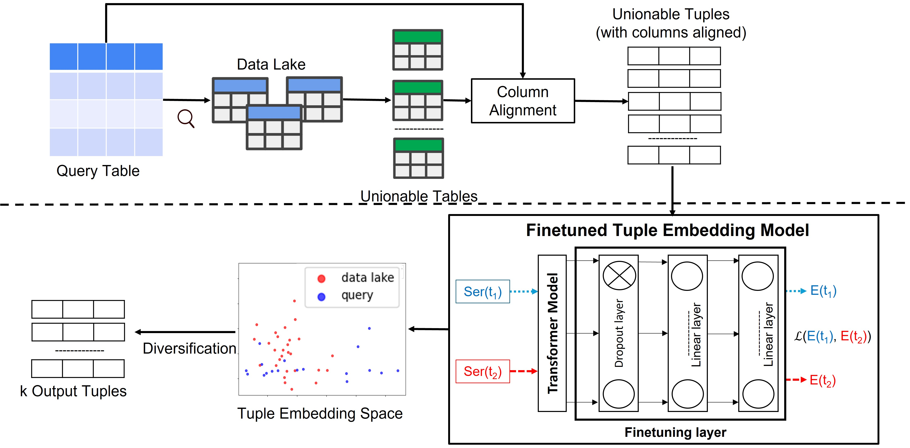

# Diverse Unionable Tuple Search (DUST)

This repository contains the implementation codes for paper: Diverse Unionable Tuple Search, currently under submission. 

*Block Diagram of DUST System*

## Abstract

Unionable table search techniques input a query table from the user and search for the data lake tables that can contribute additional rows to it. The definition of unionability is generally based on similarity measures which may include similarity between columns (e.g., value overlap or semantic similarity of the values in the columns) or tables (e.g., similarity of table embeddings). Due to this and the large redundancy in many data lakes (which can contain copies and versions of the same table), the most unionable tables may be identical or nearly identical to the query table and contain little new information. Hence, we introduce the problem of searching for unionable tuples from the data lake that are diverse with respect to the tuples already present in a query table. As a solution, we propose DUST system that searches for unionable tuples from the data lake and diversifies them. DUST uses a novel embedding model to represent unionable tuples. Then, we present an efficient algorithm that diversifies a set of candidate unionable tuples. We show that our embedding outperforms other tuple representation models by at least 15 %. Furthermore, using real data lake benchmarks, we show that our diversification algorithm is more than six times faster than the most efficient diversification baseline. We also show that it is more effective in diversifying unionable tuples than existing diversification algorithms.

## Repository Organization

- **data** folder contains the sub-folders for some datasets and placeholder for additional datasets.
- **diversity_algorithm** folder contains our novel diversity algorithm and baseline implementations.
- **dust.jpg** file shows the block diagram of DUST system.
- **README.md** file explains the repository.
- **requirements.txt** file contains necessary packages to run the project.

## Setup

1. Clone the repo

2. CD to the repo directory. Create and activate a virtual environment for this project. We recommend using python version 3.8 or higher.  
  * On macOS or Linux:
      ```
      python3 -m venv env
      source env/bin/activate
      which python
      ```
  * On windows:
      ```
      python -m venv env
      .\env\Scripts\activate.bat
      where.exe python
      ```

3. Install necessary packages. 
   ```
   pip install -r requirements.txt
   ```

## Reproducibility

1. CD to the repo.

2. To run column alignment experiments, run preprocess_align.py file by updating the parameters.

2. To finetune DUST model, run preprocess_finetune.py file by updating the parameters.

3. To run diversity algorithm, CD to diversity_algorithms and run main.py by updating the parameters.